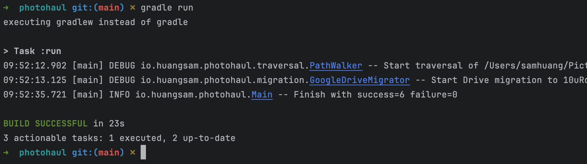

# Photohaul

Effortless photo management.

- Reorganize 10K+ photos (30 GB) in seconds!
- Migrate photos locally and to the cloud (Dropbox, Google Drive)
- Customize folder structures based on date, camera, and more
- Filter photos by file type, size, and other criteria

Say goodbye to photo clutter - 👋 + 🚀

## Motivation

As an avid photographer, I use Adobe Lightroom to organize my edited SLR
photos with custom file names and folder structures. This has worked well
for me since 2015, when I started getting serious about photography.

I want to apply those same patterns to old photos, so that it is easier
for me to access my precious memories. However, I struggle to apply the
same organization to my vast collection of older photos. I cannot apply
Lightroom settings to previously exported images and writing custom
scripts seems daunting.

I also want to migrate my photos over to a NAS or a cloud provider like
Google Drive, but it involves endless rounds of manual drag-and-drop
operations. I keep thinking to myself - is there a solution out there
that "just works" for my workflow?

## Value

Photohaul addresses the pain points above by providing a central hub for
photographers to filter, organize, and migrate photos to local storage
and cloud services. The folder structure for photos can be based on info
such as year taken and camera make.

## Getting started

For detailed instructions: [link](USERGUIDE.md)

**Install prerequisites:**

- Java 17 or later
- Gradle 8 or later

**Build application:**

- Run `./gradlew build` in your terminal

**Configure settings:**

* Set `PathRuleSet` to filter by extension, file size, etc.
* Set `MigratorMode` to `PATH`, `DROPBOX` or `GOOGLE_DRIVE`
* Set `PhotoResolver` to adjust folder structure
* Fill config file. Refer to examples in [src/main/resources](src/main/resources)

**Run application:**

* Run `./gradlew run` in your terminal

**That's it!** Sit back and rediscover your memories! 😎 + 🍹 + 🌴

You're welcome 🙏
