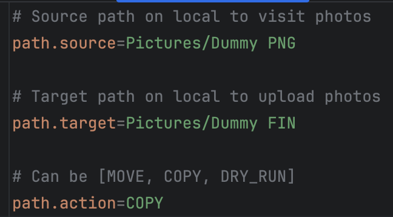
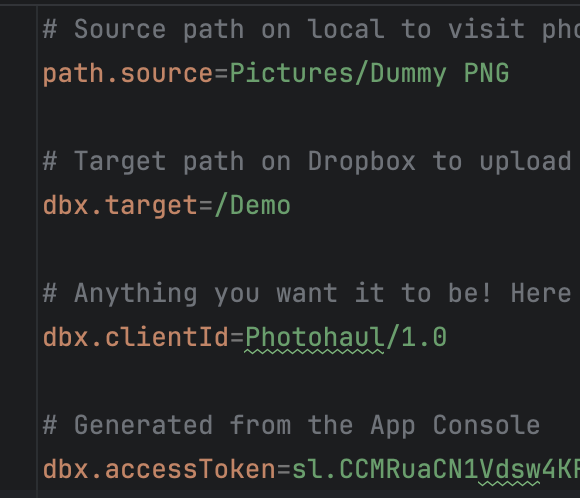
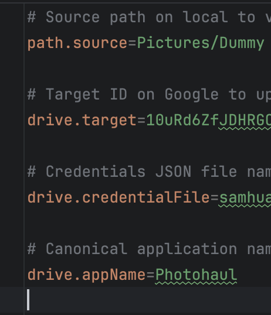

# User guide

Here's an extended version of content from the [general README](README.md).

## General setup

If you have not built the application yet, please follow the general README
to get started first.

You can specify a different configuration file for various environments or specific scenarios.
To do this, use the `-PconfigFile` Gradle property when running the application.

For example, to use a custom file located at `personal/config.properties`.

```shell
./gradlew run -PconfigFile=personal/path.properties
```

### Path setup

Configure source, target in the config:



Refer to `PathMigrator` to learn more about the `path.action` values.

### Dropbox setup

Configure source, target, credentials in the config:



[Click here](https://github.com/dropbox/dropbox-sdk-java?tab=readme-ov-file#dropbox-for-java-tutorial) to learn more.

### Google Drive setup

Configure source, target, credentials in the config:



[Click here](https://developers.google.com/drive/api/quickstart/java#set-up-environment) to learn more.

## Run migration

- Open your terminal and navigate to the `./photohaul` directory
- Run the command `./gradlew run`. This will start the migration process

This is how it looks like for Google Drive:


## Validate migration

Once the migration is complete, you can verify that your photos are uploaded
successfully. Below is an example of validating changes on Google Drive.

### Google Drive validation

**Folder creation** was successful:


Photo creation in **2015** was successful:


Photo creation in **2024** was successful:


