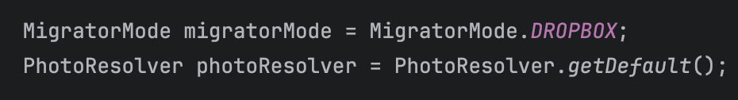
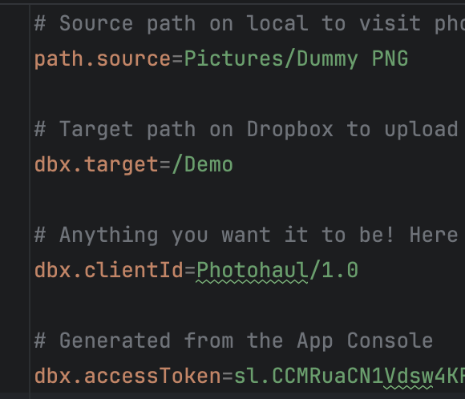
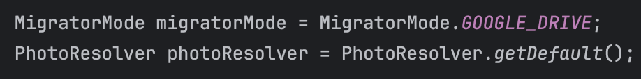
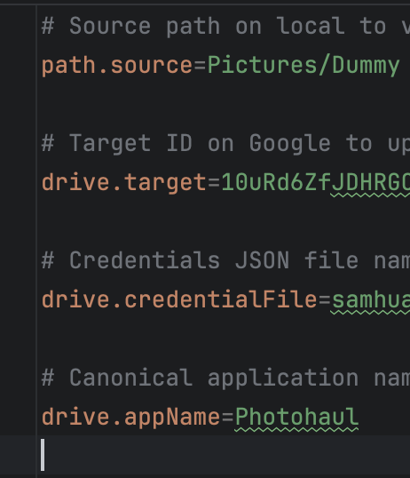

# User guide

Here's an extended version of content from the [general README](README.md).

## General setup

If you have not built the application yet, please follow the general README
to get started first.

### Dropbox setup

Set mode to `DROPBOX` in `Main.java`

Configure Dropbox credentials in `config.properties`

### Google Drive setup

Set mode to `GOOGLE_DRIVE` in `Main.java`

Configure Google Drive credentials in `config.properties`

## Run migration

- Open your terminal and navigate to the `./photohaul` directory
- Run the command `gradle run`. This will start the migration to Google Drive

## Validate migration

Once the migration is complete, you can verify that your photos have been uploaded
to Google Drive. Here's an example of how I validate the output for Google Drive.

Folder creation

Photo creation in 2015

Photo creation in 2024

