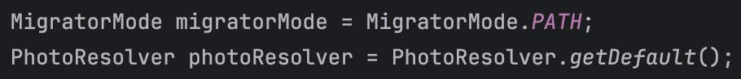
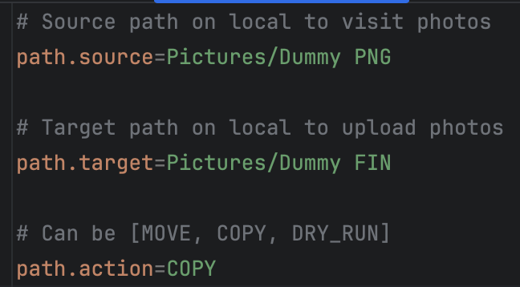

# User guide

Here's an extended version of content from the [general README](README.md).

## General setup

If you have not built the application yet, please follow the general README
to get started first.

### Path setup

Set mode to `PATH` in `Main.java`

Configure source, target in `config.properties`

### Dropbox setup

Set mode to `DROPBOX` in `Main.java`

Configure source, target, credentials in `config.properties`

[Click here](https://github.com/dropbox/dropbox-sdk-java?tab=readme-ov-file#dropbox-for-java-tutorial) to learn more.

### Google Drive setup

Set mode to `GOOGLE_DRIVE` in `Main.java`

Configure source, target, credentials in `config.properties`

[Click here](https://developers.google.com/drive/api/quickstart/java#set-up-environment) to learn more.

## Run migration

- Open your terminal and navigate to the `./photohaul` directory
- Run the command `gradle run`. This will start the migration to Google Drive

## Validate migration

Once the migration is complete, you can verify that your photos have been uploaded
to Google Drive. Here's an example of how I validate the output for Google Drive.

**Folder creation** was successful:

Photo creation in **2015** was successful:

Photo creation in **2024** was successful:

