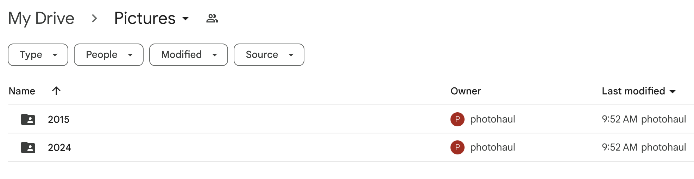
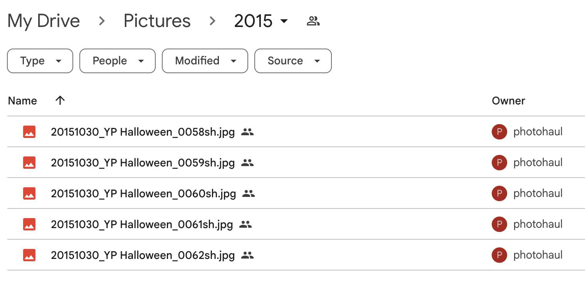
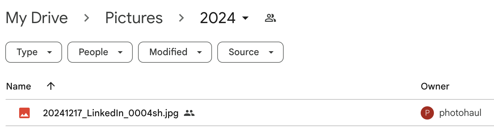

# User guide

Here's an extended version of content from the [general README](README.md).

## General setup

If you have not built the application yet, please follow the general README
to get started first.

You can specify a different configuration file for various environments or specific scenarios by passing a JVM system property.
Use the `-Dphotohaul.config=<classpath-resource-or-filesystem-path>` flag when running the application. The value can be either the classpath resource name (relative to `src/main/resources`) or a filesystem path.

Examples:

```shell
# Use the default file (no override)
./gradlew run

# Override with a classpath resource under src/main/resources/personal
./gradlew run -Dphotohaul.config=personal/path.properties

# Or override with a filesystem path (absolute or relative)
./gradlew run -Dphotohaul.config=./src/main/resources/personal/path.properties
```

Notes:

- You can use either a classpath name (`personal/path.properties`) or a filesystem path.
- Default is `config.properties` if not overridden.

### Path setup

Configure the following property fields:

- `migrator.mode`: Set to `PATH`
- `path.source`: Directory containing your photos
- `path.target`: Destination directory
- `path.action`: Choose one of the following:
    - `COPY`: Copy photos to target (original files remain)
    - `MOVE`: Move photos to target (original files removed)

### Dropbox setup

Configure the following property fields:

- `migrator.mode`: Set to `DROPBOX`
- `path.source`: Local directory containing photos
- `dbx.target`: Destination folder in Dropbox
- `dbx.clientId`: Your Dropbox app client ID
- `dbx.accessToken`: Your Dropbox access token

Refer to the [Dropbox for Java tutorial](https://github.com/dropbox/dropbox-sdk-java?tab=readme-ov-file#dropbox-for-java-tutorial) to learn how to setup the `dbx` fields.

### Google Drive setup

Configure the following property fields:

- `migrator.mode`: Set to `GOOGLE_DRIVE`
- `path.source`: Local directory containing photos
- `drive.target`: Destination folder in Google Drive
- `drive.credentialFile`: Path to your Google Drive credentials JSON
- `drive.appName`: Your application name

Refer to the [Google Drive API Java Quickstart](https://developers.google.com/drive/api/quickstart/java#set-up-environment) to learn how to setup the `drive` fields.

### SFTP setup

Configure the following property fields:

- `migrator.mode`: Set to `SFTP`
- `path.source`: Local directory containing photos
- `sftp.host`: SFTP server hostname
- `sftp.port`: SFTP server port (optional, defaults to 22)
- `sftp.username`: Your SFTP username
- `sftp.password`: Your SFTP password
- `sftp.target`: Destination directory on the SFTP server

SFTP (SSH File Transfer Protocol) is used for secure file transfers over SSH. Host keys are verified against your known hosts file for security. Ensure your server supports SFTP.

### S3 setup

Configure the following property fields:

- `migrator.mode`: Set to `S3`
- `path.source`: Local directory containing photos
- `s3.bucket`: Target AWS S3 bucket name
- `s3.accessKey`: Your AWS access key
- `s3.secretKey`: Your AWS secret key
- `s3.region`: AWS region (optional, defaults to us-east-1)

Amazon S3 (Simple Storage Service) is used for scalable cloud storage. You'll need AWS credentials with S3 permissions. Refer to the [AWS SDK for Java documentation](https://docs.aws.amazon.com/sdk-for-java/latest/developer-guide/get-started.html) to learn how to obtain and configure AWS credentials.

## Folder structure setup

By default, photos are organized into subfolders by the year they were taken. You can customize this organization structure by adding the `folder.structure` property to your configuration file.

The property value is a slash-separated (`/`) pattern of metadata keys that will define the nested folder structure.

Supported metadata keys:
- `yearTaken`: Year the photo was taken (derived from EXIF).
- `yearModified`: Year the file was last modified.
- `make`: Camera manufacturer (e.g., Canon, Apple).
- `model`: Camera model (e.g., Canon EOS 5D Mark IV).
- `focalLength`: Lens focal length (e.g., 50.0 mm).
- `shutterSpeed`: Shutter speed value (e.g., 1/125 sec).
- `aperture`: Aperture value (e.g., f/2.8).
- `flash`: Flash status.
- `iso`: ISO speed rating (e.g., 100).

Example configuration to organize photos by year taken and then camera make (e.g., `2026/Canon/my-photo.jpg`):

```properties
folder.structure=yearTaken/make
```

## Dry run (Simulation)

Dry run mode allows you to simulate a migration without actually copying, moving, or uploading any files to the destination. It logs the exact source paths and intended target destinations, making it perfect for auditing your settings and folder structures before executing large data transfers.

To enable dry run mode, add the following to your configuration file:

```properties
dryrun.enabled=true
```

## Delta migration (optional)

Delta migration is an optional feature that tracks which files have been migrated and skips unchanged files in subsequent runs. This significantly improves performance for large photo collections.

### How it works

- Photohaul maintains a `.photohaul_state.json` file that records the path, size, and last modified timestamp of successfully migrated files
- On subsequent runs, only new or modified files are migrated
- For PATH mode, the state file is stored in the target directory
- For cloud destinations (Dropbox, Drive, SFTP, S3), the state file is stored locally at the source path

### Enable delta migration

Add the following property to your configuration file:

```properties
delta.enabled=true
```

Example for `PATH` mode:

```properties
migrator.mode=PATH
path.source=Dummy/Source
path.target=Dummy/Target
path.action=COPY
delta.enabled=true
```

**Note:** Delta migration is disabled by default to ensure backward compatibility.

## Run migration

- Open your terminal and navigate to the `./photohaul` directory
- Run the command `./gradlew run`. This will start the migration process

## Validate migration

Once the migration is complete, you can verify that your photos are uploaded successfully.

Below is an example of validating changes on Google Drive.

### Google Drive validation

**Folder creation** was successful:



Photo creation in **2015** was successful:



Photo creation in **2024** was successful:


